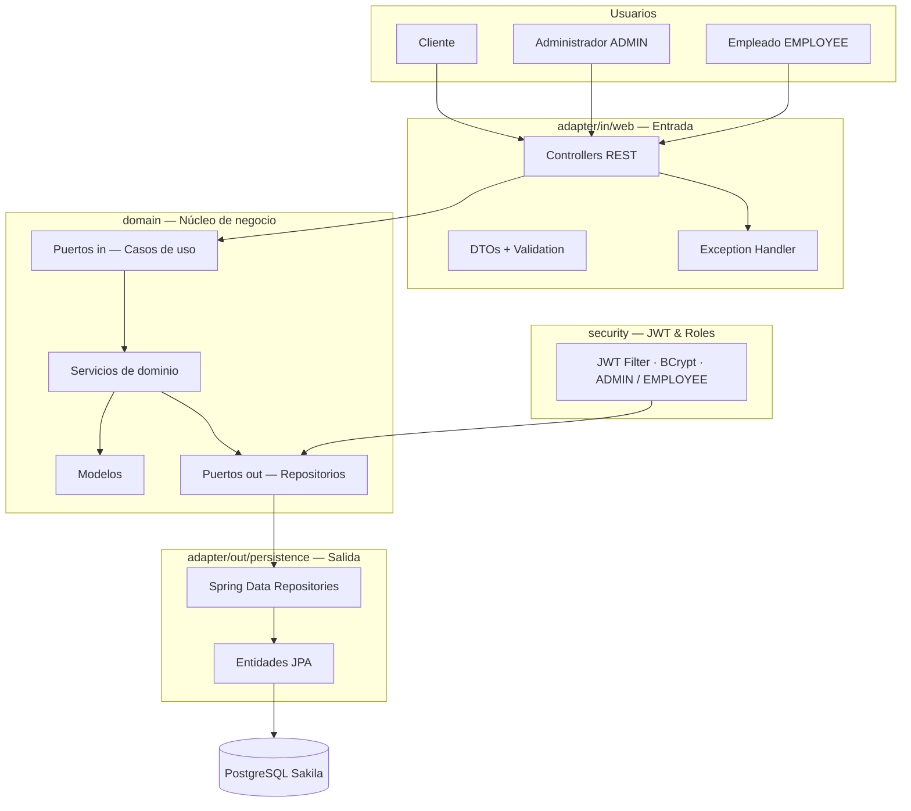

# Sakila Backend API

API REST para la gestión de películas, clientes, inventario, alquileres y devoluciones sobre la base de datos Sakila.

## Tecnologías

Java 21 · Spring Boot 3 · Spring Data JPA · Spring Security + JWT · PostgreSQL · Flyway · Springdoc OpenAPI · Testcontainers · GitHub Actions.

## Arquitectura

API hexagonal (Ports & Adapters): el núcleo de negocio no depende de Spring, JPA, HTTP ni JWT; los adaptadores de entrada y salida dependen del dominio.



## Ejecución local

```bash
# Configurar credenciales de la base de datos
cp .env.example .env

# Compilar
./mvnw clean package

# Ejecutar
java -jar target/sakila-api.jar
```

## Documentación de la API

- Swagger UI: `/swagger-ui/index.html`
- OpenAPI: `/v3/api-docs`
- Health: `/actuator/health`
