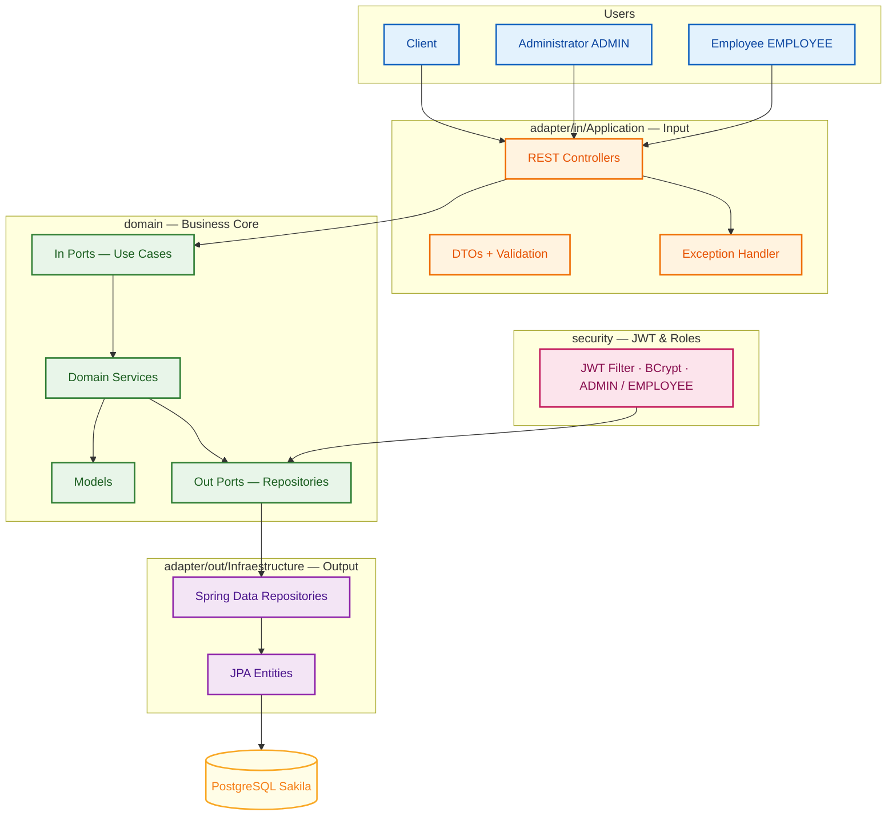

# Sakila Backend API

API REST para la gestión de películas, clientes, inventario, alquileres y devoluciones sobre la base de datos Sakila.

## Tecnologías

Java 21 · Spring Boot 3 · Spring Data JPA · Spring Security + JWT · PostgreSQL · Flyway · Springdoc OpenAPI · Testcontainers · GitHub Actions.

## Prerrequisitos

- PostgreSQL 17 con la extensión `vector` (pgvector) instalada.
- La base `sakila` se crea y se puebla ejecutando en orden los scripts de `.local/db/`: `001_schema.sql`, `002_seed.sql` y `003_users.sql`.

## Arquitectura

API hexagonal (Ports & Adapters): el núcleo de negocio no depende de Spring, JPA, HTTP ni JWT; los adaptadores de entrada y salida dependen del dominio.



## Ejecución local

```bash
# Configurar credenciales de la base de datos
cp .env.example .env

# Compilar
./mvnw clean package

# Ejecutar el JAR
java -jar target/sakila-api.jar
```

Para desarrollo con recarga en caliente:

```bash
SPRING_PROFILES_ACTIVE=local ./mvnw spring-boot:run
```

## Perfiles

| Perfil  | Uso                                                                  |
| ------- | -------------------------------------------------------------------- |
| `local` | Desarrollo; conecta a la base local con `DB_*` y expone la doc pública |
| `test`  | Pruebas de integración con PostgreSQL de Testcontainers              |
| `prod`  | Producción; toma `SPRING_DATASOURCE_*` y oculta la documentación     |

El perfil activo se define con `SPRING_PROFILES_ACTIVE`. Sin variable, Spring Boot usa `application.yml`.

## Variables de entorno

| Variable                      | Descripción                                            | Default           |
| ----------------------------- | ------------------------------------------------------ | ----------------- |
| `PORT`                        | Puerto del servidor                                    | `8080`            |
| `SPRING_DATASOURCE_URL`       | URL JDBC de la base de datos                           | local `jdbc:postgresql://localhost:5432/sakila` |
| `SPRING_DATASOURCE_USERNAME`  | Usuario de la base de datos                            | —                 |
| `SPRING_DATASOURCE_PASSWORD`  | Contraseña de la base de datos                         | —                 |
| `JWT_SECRET`                  | Secreto JWT, mínimo 32 bytes                           | —                 |
| `JWT_EXPIRATION_MINUTES`      | Minutos de expiración del token                        | —                 |
| `BACKUP_DIR`                  | Directorio de backups con `pg_dump`                    | `.local/backup`   |

Variables solo del perfil `local`:

| Variable      | Descripción                     | Default      |
| ------------- | ------------------------------- | ------------ |
| `DB_HOST`     | Host de la base local           | `localhost`  |
| `DB_PORT`     | Puerto de la base local         | `5432`       |
| `DB_NAME`     | Nombre de la base local         | `sakila`     |
| `DB_USER`     | Usuario de la base local        | —            |
| `DB_PASSWORD` | Contraseña de la base local     | —            |

Copie `.env.example` a `.env` y ajuste los valores. Nunca suba `.env` al repositorio.

## Documentación de la API

- Swagger UI: `/swagger-ui/index.html`
- OpenAPI: `/v3/api-docs`
- Health: `/actuator/health`

## CI/CD

GitHub Actions automatiza la integración y el despliegue. No hay secretos en el repositorio; todos se inyectan desde GitHub Secrets.

### CI — `.github/workflows/ci.yml`

Se dispara en push a `develop` y en pull request hacia `develop` y `main`. Ejecuta `./mvnw clean verify -Pintegration-tests`: compila, corre pruebas unitarias y de integración, genera cobertura, valida el mínimo de JaCoCo y emite `target/sakila-api.jar`.

### CD — `.github/workflows/cd.yml`

Se dispara solo con push exitoso a `main`. Reejecuta el pipeline de pruebas, publica el JAR como artefacto, desplega en Fly.io y verifica `/actuator/health`; si la app no responde `UP`, el pipeline falla.

Despliegue en Fly.io:

1. Crear la app una vez: `fly apps create sakila-api` y ajustar `primary_region` en `fly.toml`.
2. Añadir el secreto `FLY_API_TOKEN` en GitHub Secrets.
3. Añadir en GitHub Secrets las variables de la app: `SPRING_DATASOURCE_URL`, `SPRING_DATASOURCE_USERNAME`, `SPRING_DATASOURCE_PASSWORD`, `JWT_SECRET`, `JWT_EXPIRATION_MINUTES`.

El push a `main` dispara el despliegue automático.

## Criterios de aceptación

| Criterio                                             | Estado |
| ---------------------------------------------------- | ------ |
| Compila con Java 21                                  | Hecho  |
| Base Sakila cargada con Flyway                        | Hecho  |
| Endpoints definidos funcionan                         | Hecho  |
| Autenticación JWT funciona                            | Hecho  |
| Roles restringen los endpoints                        | Hecho  |
| Swagger documenta todos los endpoints                 | Hecho  |
| Validaciones devuelven errores estructurados          | Hecho  |
| Pruebas unitarias se ejecutan correctamente           | Hecho  |
| Pruebas de integración usan PostgreSQL                | Hecho  |
| Cobertura cumple los mínimos                          | Hecho  |
| GitHub Actions ejecuta el pipeline automáticamente    | Hecho  |
| El pipeline genera el JAR                             | Hecho  |
| El JAR se despliega correctamente                     | Hecho  |
| `/actuator/health` devuelve `UP`                      | Hecho  |
| No hay credenciales en el repositorio                | Hecho  |
